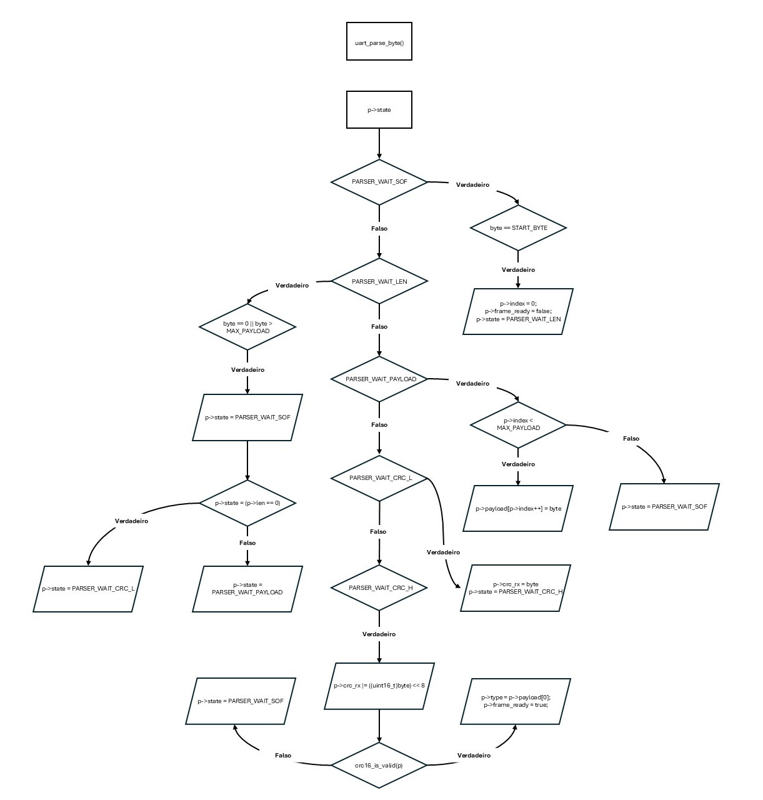
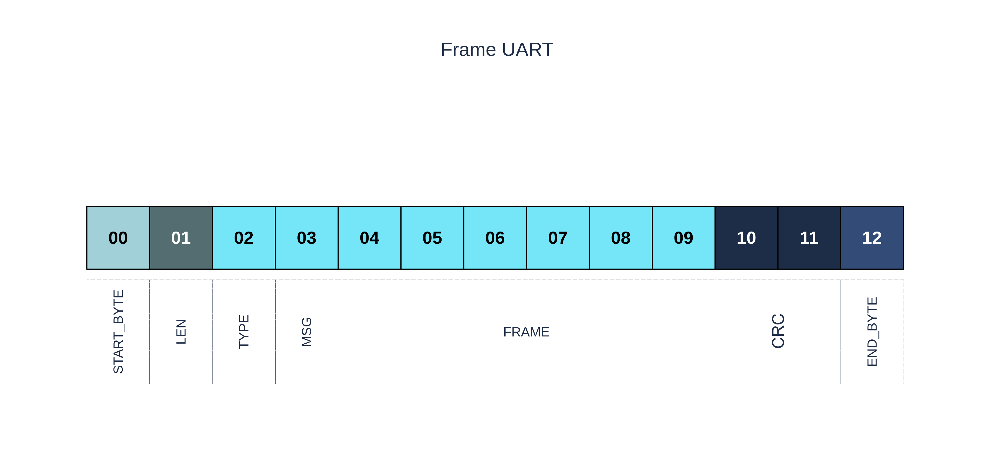
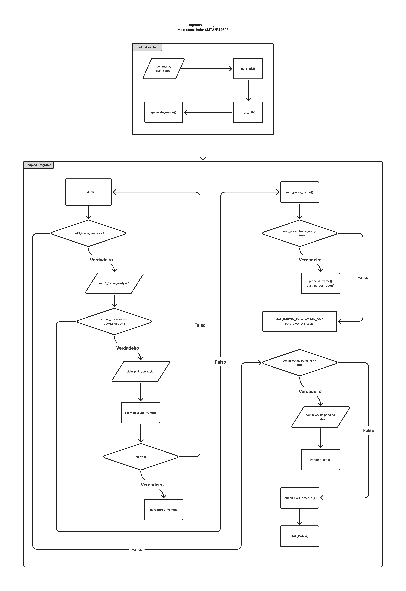
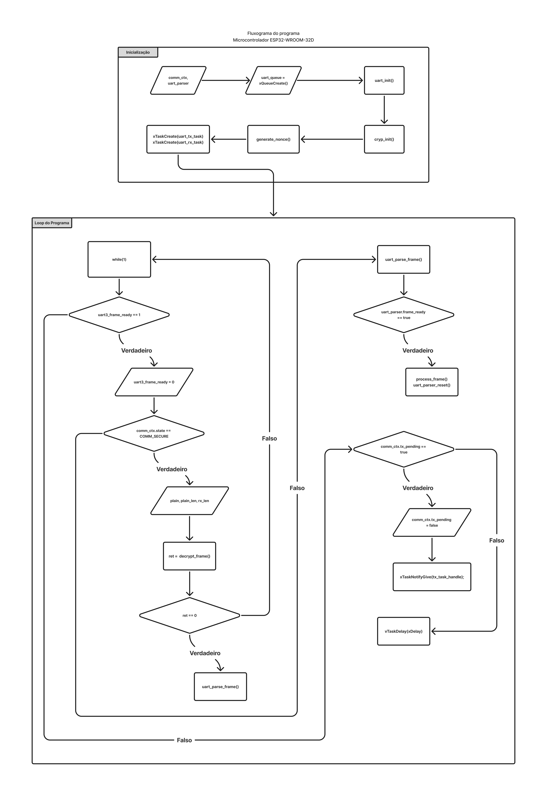
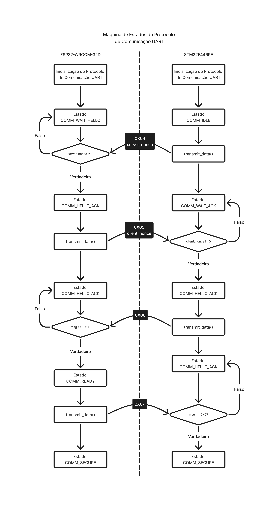

# Protocolo Seguro Embarcado implementando CRC e Criptografia simétrica com derivação dinâmica de sessão sobre UART 

## 📖 Descrição

Implementação de comunicação autenticada entre os microcontroladores STM32F446RE e ESP32-WROOM-32D, implementando  algoritmo CRC (_Cyclic Redundancy Check)-16/KERMIT_ para verificação de erros e derivação dinâmica de chaves via HKDF-SHA256, criptografia AES-CCM-128 e proteção contra ataques de repetição

## ⚙️ Funcionalidades

- Montagem de Frame UART com os bytes: *START_BYTE* e *END_BYTE*, para marcar o ínicio e fim de dito frame;
- Aplicação de algoritmo _CRC-16/KERMIT (ou CRC-16 CCITT-TRUE)_ para verificação de integridade dos dados transmitidos via protocolo UART;
- Aplicação de _Máquinas de Estados_ para controle de condições, tanto do _parser_ do Frame UART, bem como para o controle do estado do protocolo de comunicação em seu todo;
- Troca de _nonces_ entre os microcontroladores, que viabiliza a derivação dinânica de chave de sessão usando HKDF-SHA256 e chave privada, compartilhada entre os microntroladores;
- Criptografia e descriptografia, usando AES-CCM-128, implementando contador de sequência;

## 🔄 Fluxo do Protocolo

- Para a inicialização do protocolo, se faz necessário primeiro inicializar o _contexto_ de comunicação geral, usando da biblioteca [MbedTLS](https://github.com/Mbed-TLS/mbedtls), para inicializar os contextos _DRBG (Deterministic Random Bit Generator)_, _Entropy_ e _CCM_. Para depois, gerar um número aleatório que será usando como _nonce_ por ambas as partes, para serem trocadso entre si, mais à frente no Protocolo. Abaixo, trecho do código utilizado nos dois controladores:

```    
void cryp_init(crypt_context_t *ctx) {

	mbedtls_ctr_drbg_init (&ctx->ctr_drbg);
    mbedtls_entropy_init (&ctx->entropy);
    mbedtls_ccm_init(&ctx->ccm);

...

    mbedtls_ctr_drbg_seed(&ctx->ctr_drbg,
                        mbedtls_entropy_func,
                        &ctx->entropy,
                        (uint8_t*)seed,
                        sizeof(seed));
}
```

> ### Nota
> É digno de nota, que o microcontrolador STM32F446RE, não possui um periférico _TRNG (True Random Number Generator)_ implementado em hardware. Logo, para se gerar o _nonce_ do lado do cliente, se fez necessário usar do identificador exclusivo do microcontrolador (UID), o contador de ticks do sistema e o valor atual do registrador do SysTick. Devido a essa natureza de dependência de do contador de ticks e do registrador do SysTick, _nonce_ gerado, sempre era igual. Portando, em versões futuras, se faz necessário:
> - Adicionar um chip externo TRNG ou;
> - Adicionar mais fontes de entropia, como ruídos ou eventos externos.

- Depois de inicializado o contexto de comunicação geral, também se inicializa o *uart_parser*. O *uart_parser* controla os estados do parser do frame UART, como também recebe os valores do frame em sua estrutura, criando uma cópia do que foi recebido via UART. Além disso, o *uart_parser* também libera a transmissão de dados do STM32.

<figure align= "center">
    
    <figcaption>Máquina de Estados do Parser Uart</figcaption>
</figure>

- O frame UART usado para o Protocolo de Comunicação, está descrito abaixo:

<figure align= "center">
    
    <figcaption>Frame UART</figcaption>
</figure>

- Ambos microcontroladores são programados para receberem o frame, executar o parser e consumir seus dados se, e somente, *uart3_frame_ready*  ou *uart_frame_ready* serem setados. O valor de ambas as variáveis, tanto no STM32 e no ESP32, são atualizadas ao se detectar a recepção de dados, quer por meio de _Tasks_, implementadas no ESP32 usando de _FreeRTOS_, quer usando _DMA_ no caso do STM32.
- O mesmo se aplica à transmissão de dados, que é controlada pela variável *tx_pending*, contida dentro da estrutura *uart_parser*, que é setada toda vez que uma recepção de dados é bem sucedida.
- Abaixo os fluxogramas do fluxo principal do programa, primeiro para o STM32F446RE e depois para o ESP32-WROOM-32D:

<figure align= "center">
    
    <figcaption>Fluxograma STM32F446RE</figcaption>
</figure>

<figure align= "center">
    
    <figcaption>Fluxograma ESP32-WROOM-32D</figcaption>
</figure>

## 🧠 Fluxo da Máquina de Estados do Protocolo de Comunicação

- Para garantir que a comunicação entre as duas partes seja efetiva de fato, foi necessário implementar estados para o protocolo de comunicação. Como pode ser visto no fluxograma abaixo: 

<figure align= "center">
    
    <figcaption>Máquina de Estados do Protocolo de Comunicação</figcaption>
</figure>

- O protocolo foi estruturado de modo a permitir de forma determinística as etapas de negociação, autenticação e estabelecimento do canal seguro. Os estados, em ambos os controladores, foram definidos usando esse unum:

```
typedef enum comm_state_t {
    COMM_IDLE,
	COMM_HELLO,
    COMM_WAIT_HELLO,
	COMM_WAIT_ACK,
    COMM_HELLO_ACK,
    COMM_SECURE,
    COMM_ERROR
} comm_state_t;
```

- Dentro do enum *comm_state_t* temos os estados, que foram usados aqui:
> - COMM_IDLE: Que representa o sistema em repouso, sem sessão ativa ou negociação;
> - COMM_WAIT_HELLO: Estado de espera pela resposta inicial do par remoto;
> - COMM_WAIT_ACK: Utilizado para sincronização explícita do estabelecimento de sessão, reduzindo inconsistências entre os pares;
> - COMM_HELLO_ACK: Aqui se consolida a validação da negociação, confirmação do par e preperação para o COMM_SECURE;
> - COMM_READY: Cumpre a mesma função do COMM_HELLO_ACK, mas do lado do ESP32, que aqui é tratado como o "cliente", enquanto que o STM32 é tratado como "servidor";
> - COMM_SECURE: A partir daqui o Protocolo de Comunicação passa a ser cifrado. Sendo aqui, o estado principal deste Protocolo.

## 🛠️ Melhorias Futuras

- Implementação completa de todos os estados de *comm_state_t*;
- Refinar o frame criptografado, retirando alguns caracteres desnecessários.

## 📜 Licença 

[](https://opensource.org/licenses/MIT)

